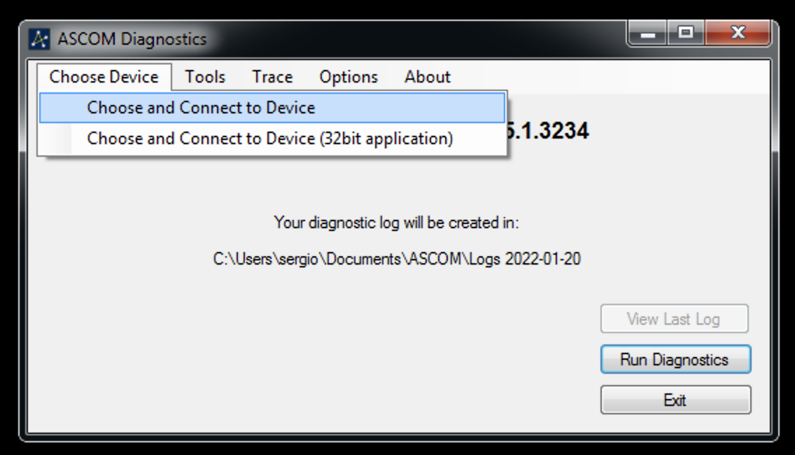

# ASCOM Alpaca on Ruby

In this repository you can find an eaxmple of how to create a new [ASCOM
Alpaca](https://ascom-standards.org/AlpacaDeveloper/Index.htm) device. The
following components have been implemented:

- Alpaca discovery - a tiny UDP server, which tells to the ASCOM client
  application that there is an Alpaca device
- Alpaca Management API - a REST/JSON API, which tells what ASCOM devices the
  current Alpaca device provides
- Alpaca Device API - also a REST/JSON API for managing a concrete ASCOM
  device. This API isn't fully implemented in this repo, only some of the
routes were added for testing purposes.

The full information about what is Alpaca device and specification for all its
components you can find in the [official
documentation](https://github.com/ASCOMInitiative/ASCOMRemote/blob/a2d60c4cdb87f60505d378b7a95d26be3db1bbaf/Documentation/ASCOM%20Alpaca%20API%20Reference.pdf).

## How to test this repo?

1. Install Ruby 3.1.0 using you favorite way. Usually, I use
   [asdf](https://github.com/asdf-vm/asdf) as Ruby version manager.
2. Clone the repo and run `foreman start`. You should see the similar output
```shell
% foreman start
21:33:06 discovery.1 | started with pid 81582
21:33:06 api.1       | started with pid 81583
21:33:07 api.1       | Puma starting in single mode...
21:33:07 api.1       | * Puma version: 5.5.2 (ruby 3.1.0-p0) ("Zawgyi")
21:33:07 api.1       | *  Min threads: 0
21:33:07 api.1       | *  Max threads: 5
21:33:07 api.1       | *  Environment: development
21:33:07 api.1       | *          PID: 81583
21:33:07 api.1       | * Listening on http://0.0.0.0:9000
21:33:07 api.1       | Use Ctrl-C to stop
```
3. Go to Windows and use ASCOM Diagnostics app, for instance. There choose the
   `Choose device -> Choose and Connect to Device`

4. In the opened window choose `Focuser` and click on `Choose`

5. Finally, the `ASCOM Focuser Chooser` window should open
6. Enable Alpaca discovery under the `Alpaca` menu

7. The `SG Focuser` device should be discovered

8. Select it and click `OK`

9. The ASCOM platform will create a COM wrapper for the `SG Focuser` device, so
   that we can use it in ASCOM COM based clients


That's it! Please, be aware that no device is implemented here - the `SG
Focuser` can be discovered, but nothing more.
